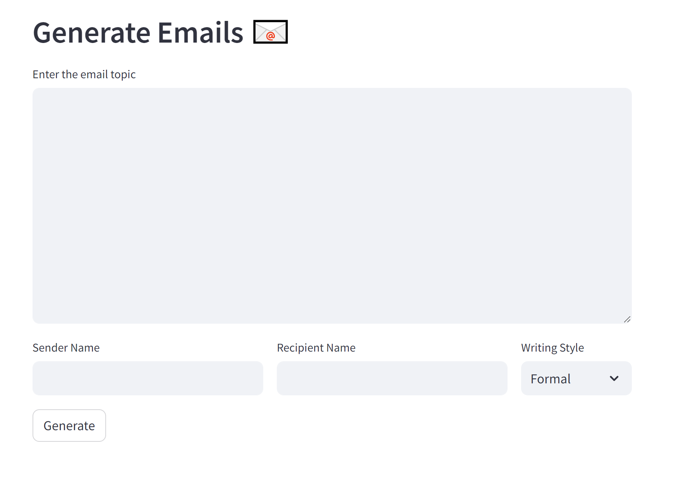
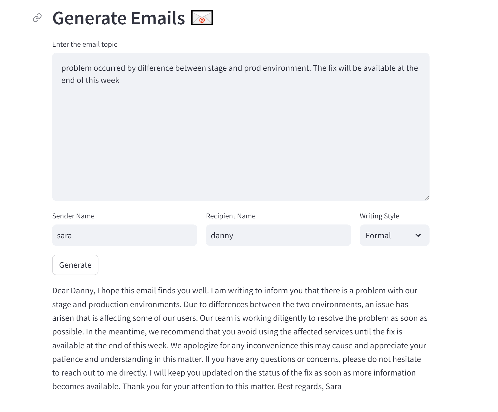

# Deloitte_EmailGenerator

Deloitte OpenAI Capstone: Email Generator

#### Users provide input prompts and styles based on their needs, and AI generates a sample email that they could use. As the prompt becomes more specific, AI generates more tailored sample emails. These emails can be modified based on the prompt, such as write in 5 sentences

Bot generate emails whenever 'Generate' button is clicked. It can take 10 seconds to 120 seconds depends on the environment including wifi.

In order to use, download model from https://huggingface.co/TheBloke/Llama-2-7B-Chat-GGML/tree/main (need to create account in huggingface) and update the path from app.py, line 8

### Demos

